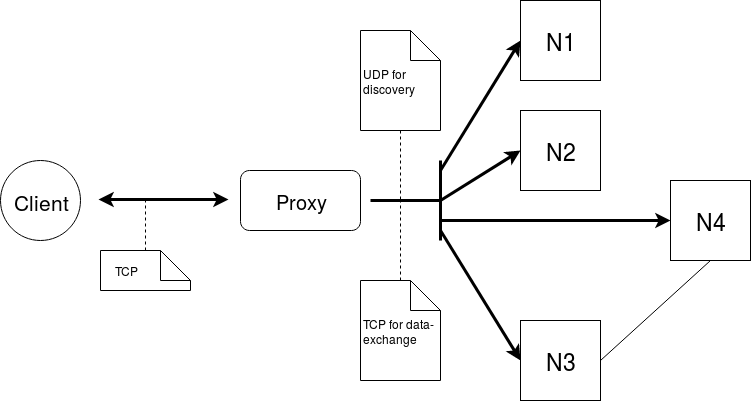
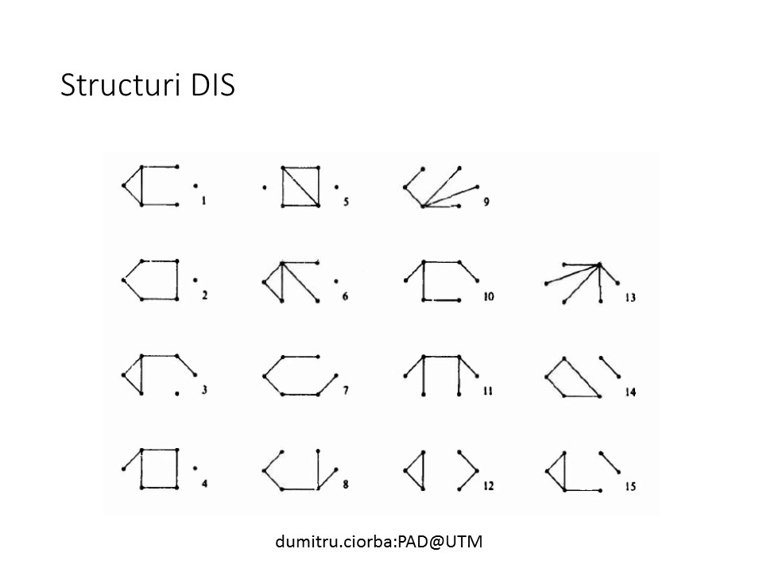

## Colecții distribuite de date semi-structurate

Scopul lucrării de laborator rezidă în studiul protocoalelor de transport TCP/IP în contextul dezvoltării unei aplicații conținând colecții distribuite de date.
În cadrul acestui laborator trebuie folosite unul din formatele XML (DOM/ SAX) și JSON pentru stocarea/transportarea datelor.

### Prerequisites

- VCS (Version Control System) Git - vezi [info din procesul de susținere](submission-process.md);
- Cunoștințe despre: git, protocoale de transport;
- Cunoștințe de bază despre sisteme distribuite - noțiune și caracteristici.
- Cunoștințe despre: date semi-structurate (XML, JSON).
- Cunoștințe de bază despre sisteme distribuite - noțiune și caracteristici;
- Cunoștințe de bază despre modalități de validare a datelor în format XML;

Note:
- Informație despre git și linkuri utile găsești în [procesul de sustinere](submission-process.md);
- Pentru info despre sisteme distribuite consultă urmatoarele surse:
    + [Distributed systems: principles and paradigms](https://moodle.ati.utm.md/pluginfile.php/5693/mod_glossary/attachment/8/distributed-systems-principles-and-paradigms-2nd-edition.pdf)
    1.1 DEFINITION OF A DISTRIBUTED SYSTEM (p 2)
    1.2 GOALS
    + [Indicații metodice de pe moodle](https://moodle.ati.utm.md/mod/book/view.php?id=1648)
    + [Note de curs despre schimb de date](https://moodle.ati.utm.md/mod/book/view.php?id=2019)

### Obiective

- Aplicarea protocolului UDP în transmisiuni unicast și multicast;
- Aplicarea protocolului TCP în transmisiuni de date;
- Procesarea colecțiilor de obiecte.
- Dezvoltarea unui sistem cu date distribuite eterogene și utilizarea unui mediator pentru accesarea acestora.
- Crearea unui modul de validare a datelor de format XML ce parvin centralizat de la nodul de mediere, Maven,  spre client.

### Sarcinile și baremul

##### Implementarea unui sistem informațional ce oferă colecții distribuite de date (nota 5-6)

Sistemul distribuit este format din 2 componente de bază:
- Mediatorul/Proxy;
- Nodul informațional.

În cadrul sistemului distribuit sunt folosite 2 protocoale de transport:
- **UDP** pentru schimbul de meta-informație între componente (discovery service);
- **TCP** pentru schimbul/transportarea datelor.

**Nodul informațional** este un component indipendent care conține o colecție de date de același tip (e.g. Angajat(nume, prenume, salariu)).

**Mediatorul** este *intermediarul* prin intermediul căruia clientul obține datele de la sistemul distribuit. Rolul mediatorului este de a asigura o comunicare transparentă între sistemul distribuit și client.

Comunicarea între *client* și *sistemul distribuit* are loc în următoarele etape:
- Conectarea de către **client**, prin *TCP*, la **mediator**;
- **Mediatorul** inițiază schimbul de meta-informație de la noduri expediind un pachet de date prin **UDP multicast** (în pachet mediatorul își indică adresa și portul la care acceptă răspunsul prin **UDP unicast**)
- Fiecare **nod informațional** care a primit cererea de la mediator expediată prin multicast, expediază mediatorului *legăturile* proprii, *adresa și portul TCP* la care nodul acceptă conexiunile
- **Mediatorul**, după un interval de timp, procesează răspunsurile primite de la noduri și colectează datele de la noduri, **asigurînd** acoperirea maximă;
- Datele agregate de la noduri **mediatorul** le expediază **clientului** prin conexiunea din etapa 1.

**Cerințe:**
- Elaborarea protocolulului de comunicare între client și sistem informațional distribuit;
- Elaborarea și implementarea nodului informațional;
- Elaborarea și implementarea mediatorului;
- Determinarea/descoperirea nodurilor utilizînd UDP multicast;
- Schimbul de date utilizînd utilizînd TCP;
- Datele sunt serializate în JSON sau XML.

##### Serializarea în diferite formate (nota 7)

- Nodurile informaționale serializează datele în JSON;
- Mediatorul serializează datele colectate în XML;
- Clientul validează datele primite folosing XML Schema Definition (XSD) sau DTD.

##### Elaborarea și implementarea unui simplu limbaj de interogări (nota 8)
Posibilitatea de a procesa parțial colecția distribuită de date pe nodurile informaționale.
Adică, nodurile informaționale trebuie să accepte construcții specifice, pentru
a efectua operații sortare, filtrare sau grupare nemijlocit pe nodurile informaționale.
Se acceptă orice [DSL](https://en.wikipedia.org/wiki/Domain-specific_language)
, începînd de la simplu dicționar pînă la pseudo-SQL.

Cerințe către sistem:
- Oferirea interfeței de interogare a nodurilor cu cel puțin una din operații
    - filtrare,
    - sortare,
    - grupare
    
##### Implementarea posibilității de a cere datele într-un format anumit (nota 9)
Se cere adăugarea unui grad de flexibilitate mai mare în ceea ce privește formatul expus
de către Mediator. Adică, clientul trebuie să aibă posibilitatea de a solicita fie XML, fie JSON.

- Clientul poate specifica în ce format datele trebuie să fie reprezentate;
- Dacă clientul a solicitat XML, clientul aplică validarea implementată la etapele precedente;
- Mediatorul trebuie să serializeze datele colectate în dependență de formatul
solicitat de către client;

##### Validarea datelor în formatul JSON (nota 10)
La etapele precedente se valida doar răspunsul primit în formatul XML (fiindcă e standartizat).
Se cere validarea răspunsului primit în formatul JSON utilizînd JSON schema.

- Validarea datelor în formatul JSON de către client. Utilizînd [JSON Schema](http://json-schema.org/).

#### Structuri DIS

Alege structura în dependență de numărul ordine.

