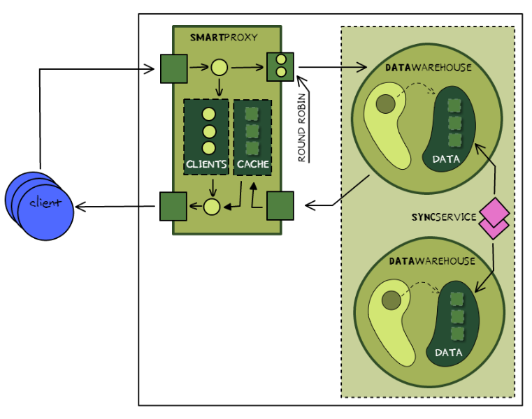

## Web proxy: realizarea transparenței în distribuire

Studiul metodelor de caching și load-balancing aplicate la crearea unui serviciu proxy

### Prerequisites

- VCS (Version Control System) Git - vezi [info din procesul de susținere](submission-process.md);
- Cunoștințe despre:
    - HTTP
    - Caching
    - Redis
    - (R)DBMS

Note:
- Informație despre git și linkuri utile găsești în [procesul de sustinere](submission-process.md);
- Pentru info despre sisteme distribuite consultă urmatoarele surse:
    + [Forward Proxy vs Reverse Proxy](http://www.jscape.com/blog/bid/87783/Forward-Proxy-vs-Reverse-Proxy)
    + [Indicații metodice de pe moodle](https://moodle.ati.utm.md/mod/book/view.php?id=1780)

### Obiective

- Aplicarea protocolului HTTP în transmisiuni de date;
- Elaborarea modulului reverse proxy;
    - Implementarea mecanismului de caching,
    - Implementarea mecanismului de load-balancing,
    - Elaborarea sincronizării datelor (distribuirea în date) între nodurile **data-warehouse**
(utilizînd un (S)DBMS existent).

### Sarcinile și cerințele

##### Elaborarea și implementarea a sistemului *proxy*
**Proxy** este un modul intermediar între client și sistem (end-server).
Scopul principal a utilizării unui sistem *proxy* este înlăturarea comunicării directe
între aplicația client și sistem. În așa mod după *proxy* putem avea o infrastructură
complexă și/sau distribuită. Un astfel de intermediar permite integrarea mecanismului
de caching și load balancing (pentru sisteme distribuite).

**Caching** permite să evităm procesarea interogărilor indentice care sunt sigure (*safe*).
Ideea este foarte simplă - pentru fiecare interogare se atribuie un identificator
(de ex în cazul la HTTP - URI + content type) și dacă în **cache** (bază de date cheie-valoare, vezi Redis)
există date pentru acest identificator, atunci proxy evită procesarea interogării și
returnează datele existente din cache.

**Load balancing** permite distribuirea interogărilor între nodurile informaționale a unui
sistem distribuit. *Load balancing* este o procedură prin care *proxy (intermediarul)*,
conform unui algoritm, alege nodul informațional a sistemului distribuit care va
procesa interogarea clientului.

##### Cerințele către sistem

Reprezentarea schematică a sistemului

Sistemul elaborat trebuie să realizeze următorul funcțional:
- Acceptarea conexiunilor de la client (request-uri HTTP GET),
- Verificarea existenței răspunsului în cache (considerând URI și content type),
    - Dacă există răspuns în cache, se returnează la client.
- Distribuirea interogărilor între nodurile **data-warehouse** (*load balancing*),
- Procesarea interogărilor de către nodurile data-warehouse,
    - Sincronizarea datelor între nodurile data-warehouse se face utilizînd un
    (R)DBMS existent.
- Returnarea răspunsului către client.

##### Cerințe către echipă

- Se lucrează în echipe a cîte 4-5 persoane;
- Se utilizează un repozitoriu GIT comun;
- **Toți** membrii echipei contribuie la dezvoltarea proiectului;
- Laboratoarele 1 și 2 rămân obligatorii pentru lucru individual.

##### Cerințele către susținere

Susținerea proiectului constă din:
- raportul intermediar - în limba franceză, unul pentru toată echipa;
- raportul final - în limba franceză, unul per echipă, se expediază în prealabil;
- prezentarea produsului final (examen final) - 10-15 min, toată echipa, în limba română;
- răspunsul verbal la întrebări (examen final) - individual, limba română (franceza va fi considerată ca bonus).

**Termen limită pentru raportul intermediar - ultimul laborator în cadrul cursului (15 decembrie).**
